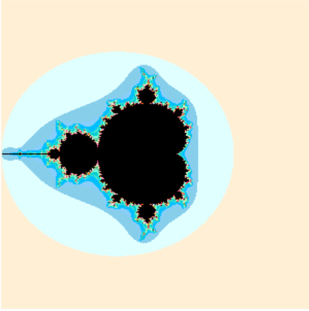
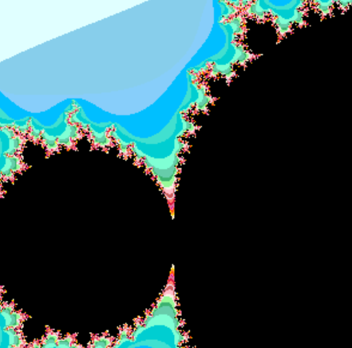
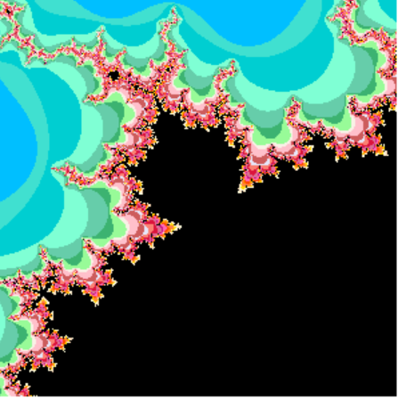
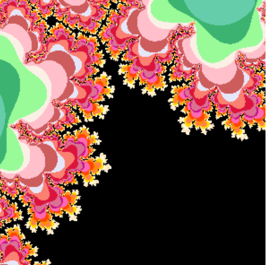

# mandelbrot

The mandelbrot fractal is the mathmatical sequence Zn+1= Z2n+C . It makes a particular pattern when plotted and the pattern can continue infinitely. This program allows you to zoom in to a visualization of this phenomenon.

